# 🖊️ Handwritten Digit Recognition with CNN

## 🚀 Project Overview
This project is a **handwritten digit recognition system** using a **Convolutional Neural Network (CNN)**.  
The model is trained on the **MNIST dataset** and allows users to **draw a digit**, which the model predicts with a confidence score.

---

## 📂 Folder Structure
```
/images/       # Screenshots of my Jupyter notebook code and script breakdown
/digit_recognizer.keras  # Trained model file
/digit_draw.py  # GUI-based digit drawer
/train.csv, test.csv  # MNIST dataset
/README.md     # Project documentation
```

---

## 🛠️ **How It Works**

### **1️⃣ Import Libraries**
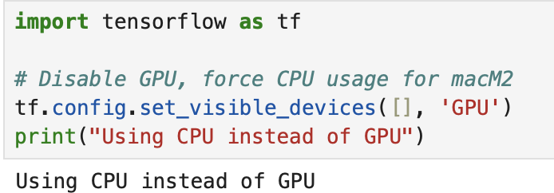
- Load necessary libraries for **data processing, visualization, and deep learning**.
- TensorFlow is used for **building the CNN model**.

### **2️⃣ Load & Inspect Data**
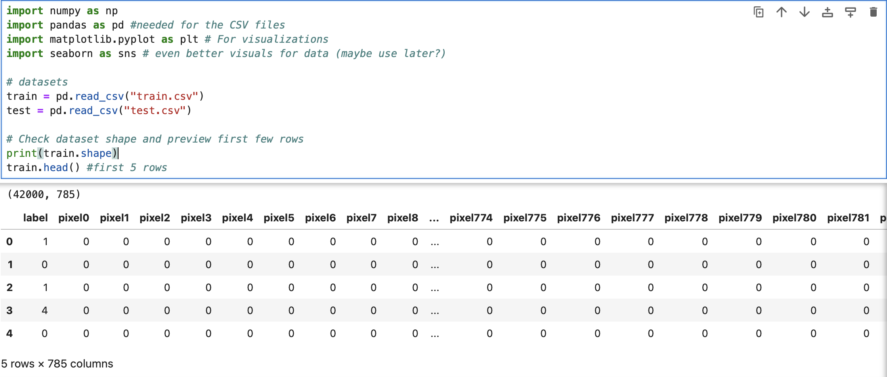
- Load `train.csv` and `test.csv` containing **grayscale 28x28 images**.
- Display the **first few rows** to understand the structure.

### **3️⃣ Preprocess Data**
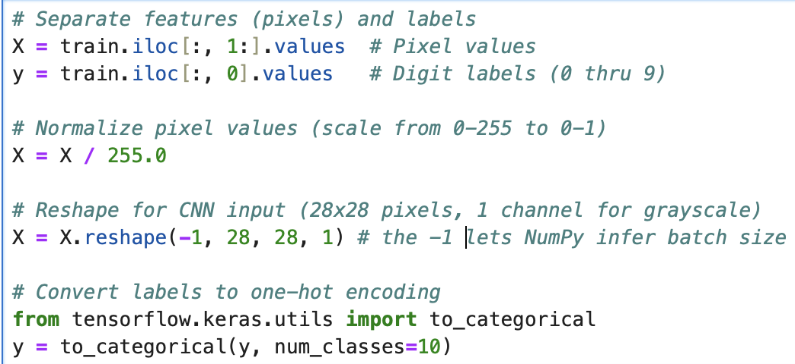
- Separate **features (pixel values) and labels (digits 0-9)**.
- Normalize images **(scale 0-255 → 0-1)** for better training.
- Reshape images to **28x28x1** for CNN input.
- Convert labels to **one-hot encoding** for classification.

### **4️⃣ Apply Data Augmentation**
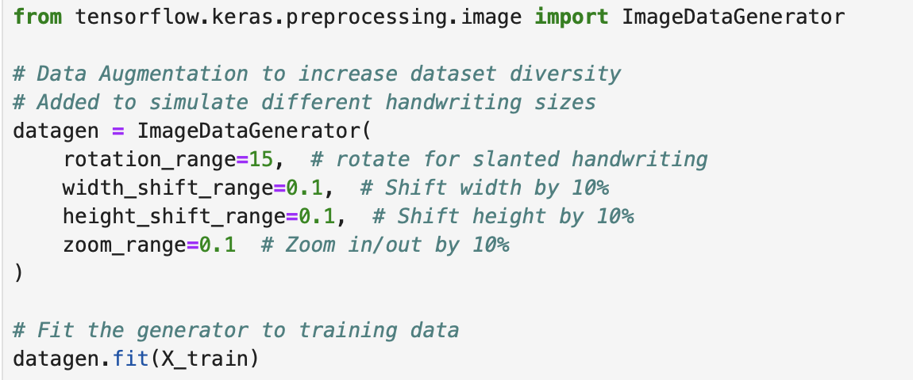
- Randomly **rotate, shift, and zoom** images to improve model generalization.
- Uses `ImageDataGenerator` to apply augmentations **during training**.

### **5️⃣ Split Dataset**
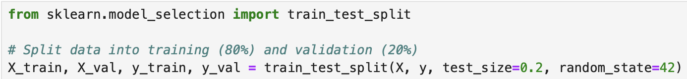
- Splits data into **training (80%)** and **validation (20%)** sets.
- Ensures model is tested on unseen data.

### **6️⃣ Build the CNN Model**
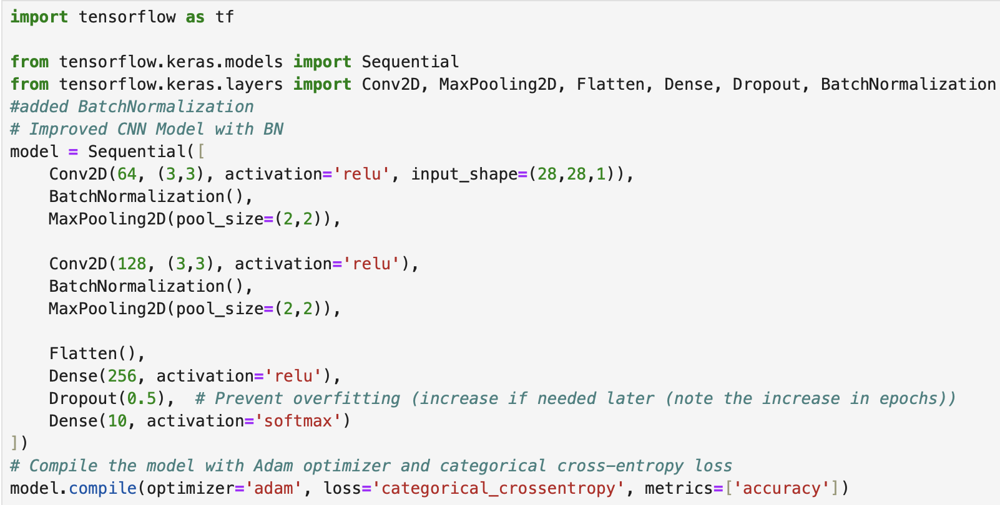
- Uses **Convolutional Layers (Conv2D)** to extract features.
- Includes **Batch Normalization** for stable training.
- **MaxPooling** reduces image size while keeping important details.
- **Dropout (0.5)** prevents overfitting.

### **7️⃣ Train the Model**
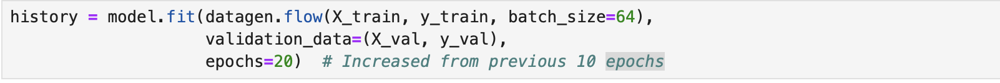
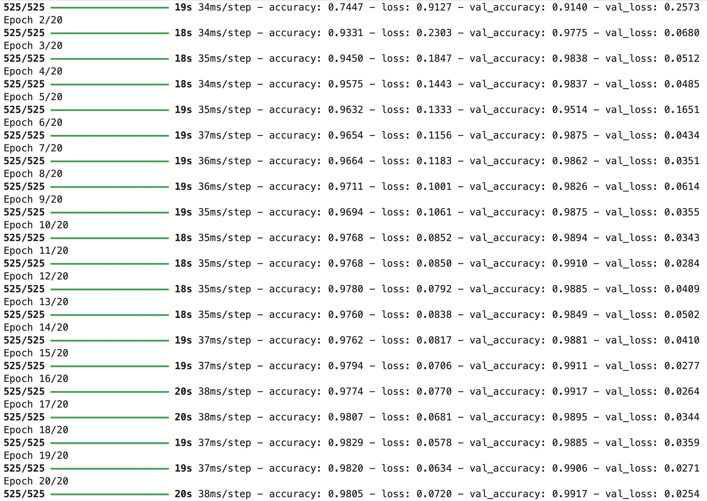
- Trains for **20 epochs** using the augmented dataset.
- Uses `Adam` optimizer and **categorical cross-entropy loss**.
- Monitors **validation accuracy** to prevent overfitting.

### **8️⃣ Evaluate on Test Data**
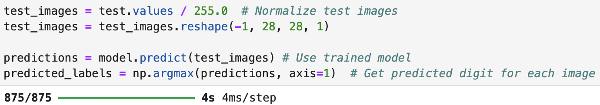
- Loads **unseen test images**, applies preprocessing, and makes predictions.
- Extracts the **most confident digit** for each image.

### **9️⃣ Test on Random Samples**
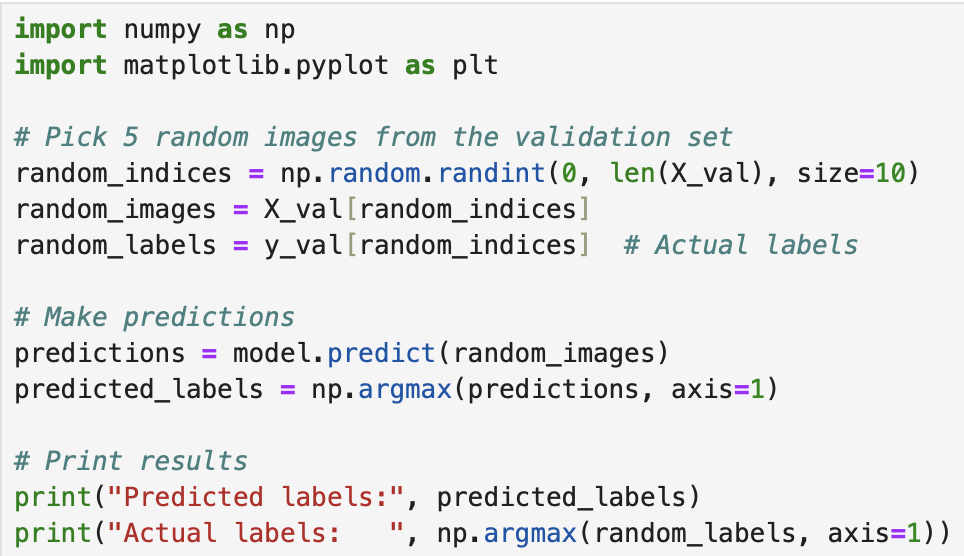
- Picks **10 random validation images** and checks **predictions vs actual labels**.
- Displays the predicted values.

### **🔟 Visualizing Predictions**
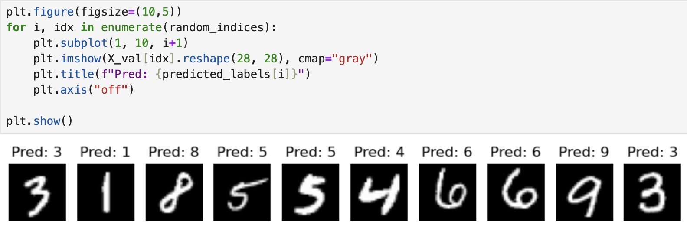
- Plots **10 randomly selected images** with their **predicted labels**.
- Uses `matplotlib` to display them in grayscale.

### **🎨 GUI-Based Digit Drawer**
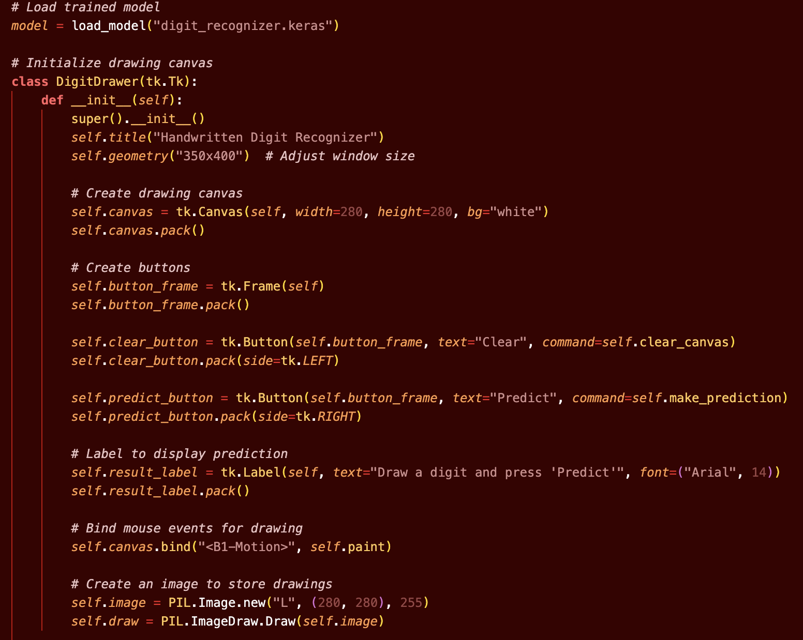
- Allows users to **draw digits on-screen** and get real-time predictions.
- Uses **Tkinter** for the graphical interface.

### **🤖 How the Model Predicts**
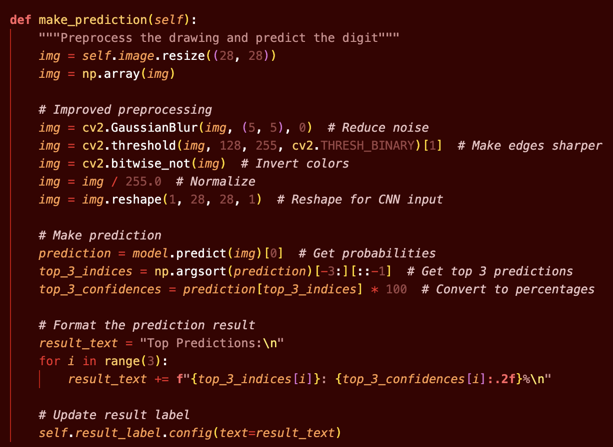
- Captures **user-drawn images**, processes them, and feeds them into the model.
- Displays **top-3 predictions** to avoid overconfidence.

### **✍️ Image Processing Logic**
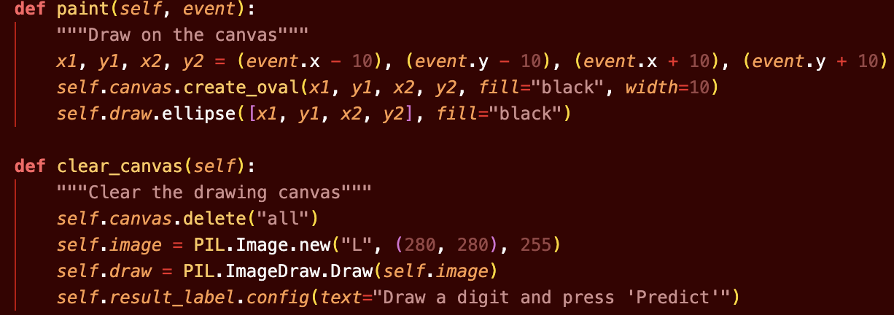
- Uses OpenCV (`cv2`) to **smooth and preprocess user input**.
- Inverts colors, normalizes pixel values, and reshapes the image.

## ** Example **
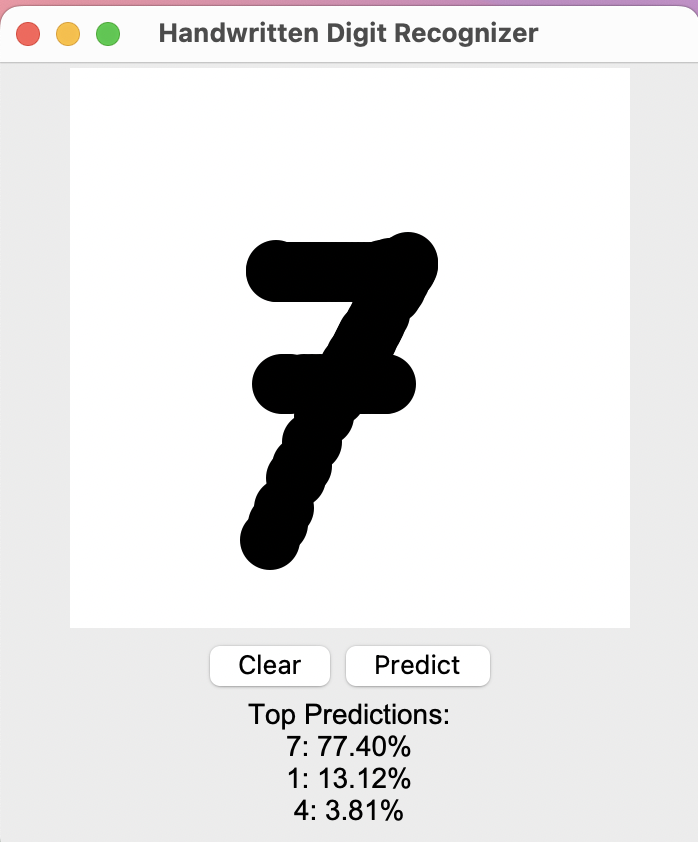

---


## **📌 Future Improvements**
✅ **Improve accuracy with deeper CNN models**  
✅ **Deploy as a web app for profolio**  
✅ **Allow multiple digit recognition (e.g., full numbers instead of single digits)**  

---

